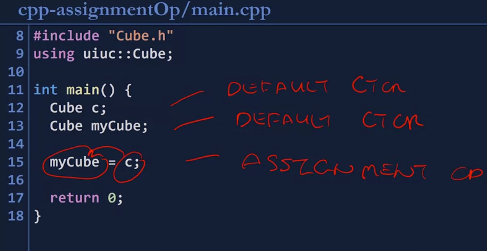

- defines a behavior of using the assignment operator or the equals sign in code
- constructor creates a new object, while an assignment operator replaces the value of an existing object
-  every object in C++ has to be constructed, Once it's been constructed, it can never be constructed again.
- to change the value of an existing class, a class that's already been constructed, it must be changed through an assignment operation.
## Default automatic assignment operator
- The assignment operator will try and copy the contents of the values
## Custom assignment operator 

Four properties: 
1. The custom assignment operator must be a public member function of the class,
2. The custom assignment operator must have the function name, `operator=`
3. It has to have a return value of the reference of the class type
4.  it must have exactly one argument and the one argument must be a const reference to the class' type

```
namespace uiuc {

Cube::Cube() {

length_ = 1;

std::cout << "Default constructor invoked!" << std::endl;

}

  

Cube::Cube(const Cube & obj) {

length_ = obj.length_;

std::cout << "Copy constructor invoked!" << std::endl;

}
  
Cube & Cube::operator=(const Cube & obj) {

length_ = obj.length_;

std::cout << "Assignment operator invoked!" << std::endl;

return *this;

}

  

double Cube::getVolume() {

return length_ * length_ * length_;

}

  

double Cube::getSurfaceArea() {

return 6 * length_ * length_;

}

  

void Cube::setLength(double length) {

length_ = length;

}

}
```

- Anytime there's an custom assignment operator, `*this` the dereference of an instance of the class is returned. 
## example 




- two objects are created and constructed, therefore the default constructor
- Assign. Op and Copy Ops: 
	- Their functionality is largely the same, that their job is to copy the contents of one instance of a class to another.
	- But the times invoked are slightly different. The invocation of an assignment operator means the object already exists and doesn't need constructed.