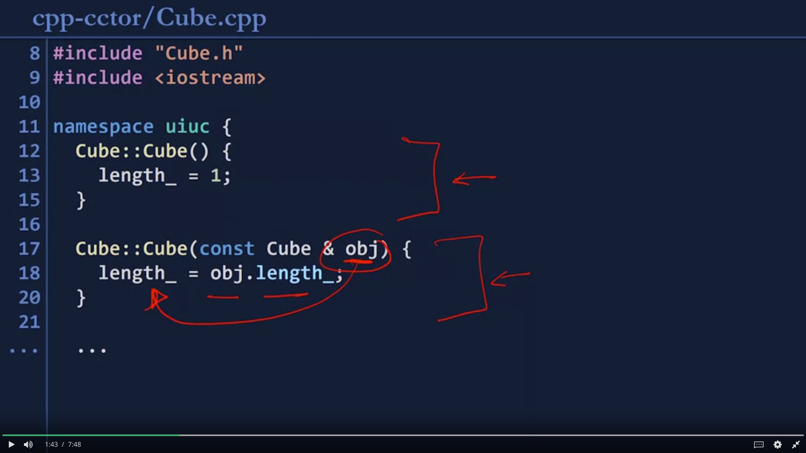
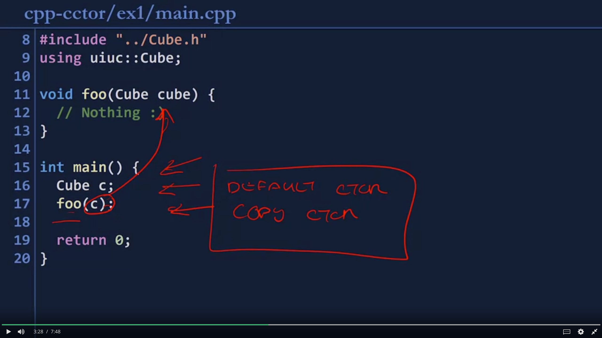
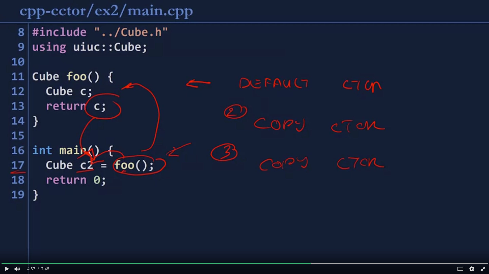
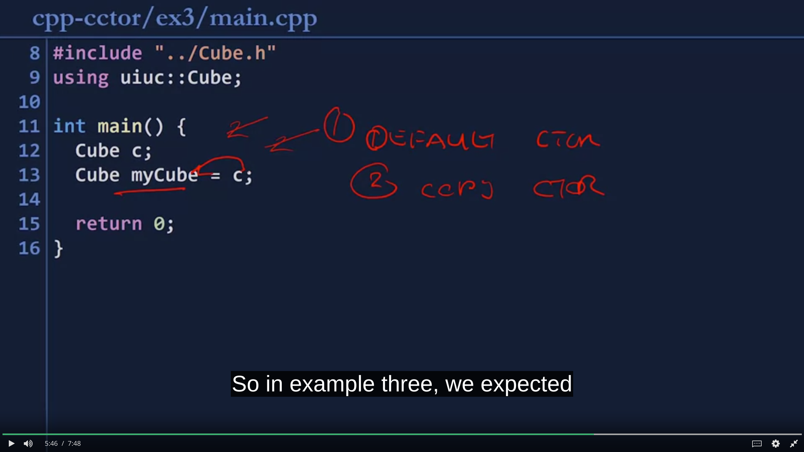
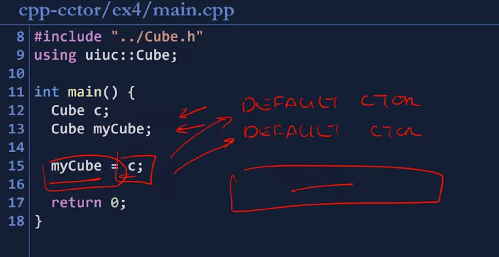

## Automatic copy constructor 
- If none copy constructor is generated, this will be given 
- The automatic copy constructor is going to copy the contents of all variables.

## Custom copy constructor 
1. Criteria
	- The function needs to be a class constructor
	- it must have exactly one argument
	- and that argument must be a constant reference to the same type as the class itself.


```
// A constant cube is passed by referenced obj
Cube::Cube (const Cube &obj)
```

2. Example 


- In the custom copy constructor, `length_` (a variable of the Cube class) is assigned the value of the referenced `obj`
- Because automatic copy constructor is going to **copy the contents of all variables**, this code above does exactly this.


3. Copy constructor invocation 
	They get invoke in almost every case
	- pass an object as a parameter by value into another function
	- or if we return an object by value from a function 
	- Initializing a new object from a previous version 


4. Examples of copy constructor invocation 

### example 1 



- Object `c` of type `Cube` is passed into `foo()`
- `c` is the copy from `main()` into the `foo()` stack frame 

### example 2 


- when `foo()` is called, it returns object `c` (3rd in invocation scenarios mentioned above). Thus, a copy constr. is generated. This can also be think of as moving from the stack of `foo()` into `main()`
- Then object `c2` is asigned the value returned by `foo()`, another copy constr. is out. 

### example 3 


	-  `myCube` is assigned the copy of `c`

### example 4 


- constructor job is to create the object itself 
- because we're not doing any construction, we're just doing copying.
- because `myCube` was already constructed here unlike the previous example where `myCube` was constructed at the time it was being assigned
- therefore, no constructors are called
