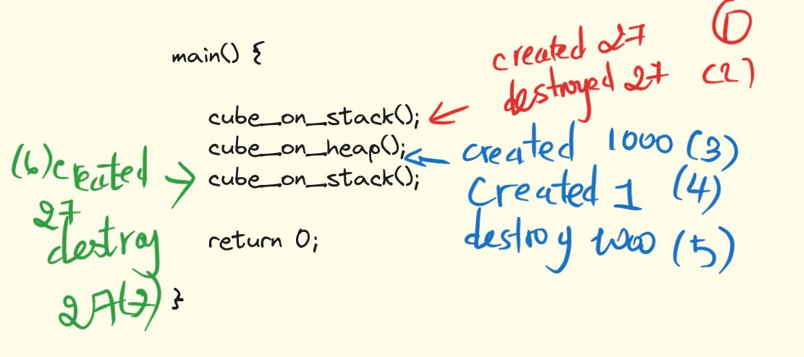

- is called as the very last call in the class's lifecycle, and then it cleans up the instance of the class.
## Automatic default constructor
- The automatic default destructor only calls the destructor of other member variables
- If your object is in the stack memory, your destructor is going to be called as soon as the **function returns**
- If it's on the heap, the destructor is only called when that **delete keywords used**
- The destructors aren't called at compile time, but rather during runtime
- automatic calls to the destructor in appropriate places where stack objects should be destroyed as they go out of scope, or where heap objects are destroyed with "delete".

## Custom constructor 

- A custom constructor has to be a member function.
- The custom constructor has to be the name of the class itself, preceded by a tilde `~`
- all the destructors have to have no arguments and no return type
- These are the scenarios where cc is necessitate: 
	-  we create a new memory inside the class on the heap, we need to destroy it.
	- if we've opened any files or shared any other memory, then we also need to make sure that we define a custom constructor, so we can close a file, remove the shared memory.
	- 

## Example 


```
double cube_on_stack() {

	Cube c(3);
	return c.getVolume();

}

void cube_on_heap() {

	Cube * c1 = new Cube(10);
	Cube * c2 = new Cube;
	delete c1;

}

int main() {

	cube_on_stack();
	cube_on_heap();
	cube_on_stack();

	return 0;

}
```

