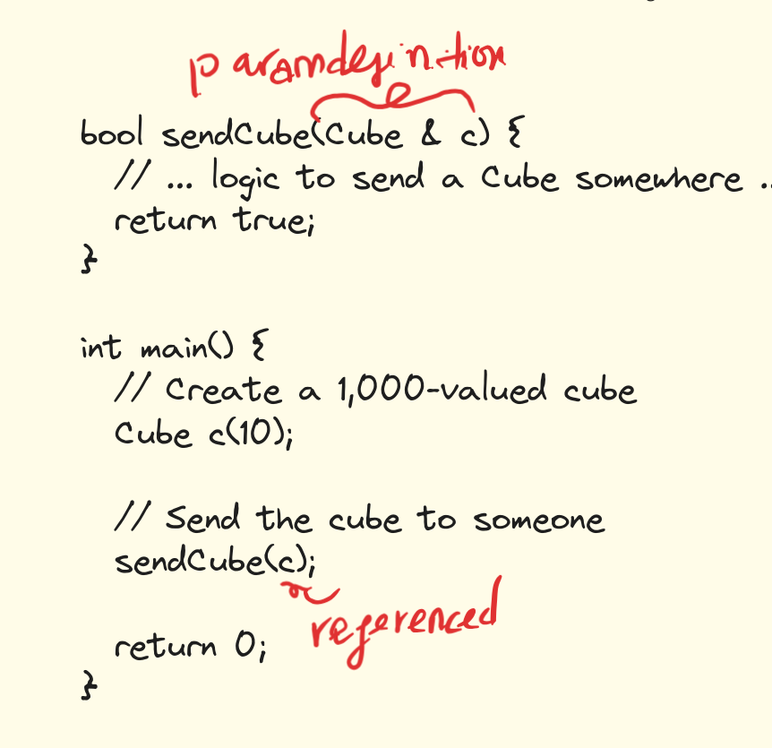
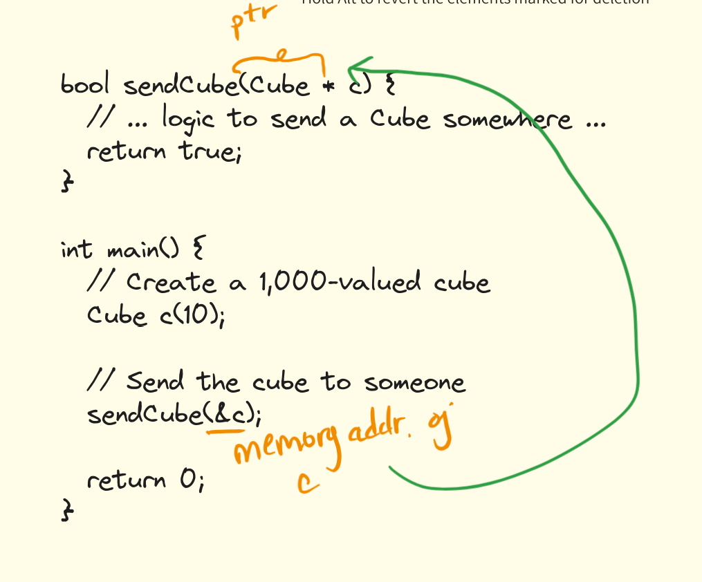

## Pass by value

```
bool sendCube(Cube c) {

// ... logic to send a Cube somewhere ...

return true;

}

int main() {

// Create a 1,000-valued cube

Cube c(10);

// Send the cube to someone

sendCube(c);

return 0;

}
```

- Similar to the store by value example, `c` is passed as value to `sendCube()`
- 2 cubes are created: one default constructed,the other copy constructed 
## Pass by references



`c` is sent into `sendCube` by alias, no copies are made

## Pass by pointer



- address of c is passed to a pointer
