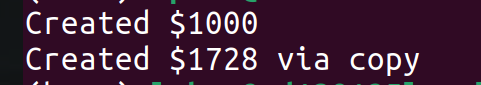

## Storages 
 
 Variable can be stored in 3 different ways: 
	- directly in memory
	- accessed via a pointer 
	- or accessed by a reference

1. in direct memory (by default)
	- The type has no modifiers
	- the obj takes exactly same size in memory 
```
Cube c; //stack memory 
int i; 
uiuc::someclass p; //specialized class
```
2. via pointer 
	- modified with `*`
	- it takes memory address width (i.e: I'm on a 64-bit machine on a 64-bit machine, the memory address is 64 bit long)
	- As we learned with heap memory, a pointer simply point to the memory allocated for the object
3. via references 
- alias existing memory by name, anoted `&`
- never store any memory itself
- must be alias soon as it's created 


- changing to `cube` or to `c` does the same thing. 

## Examples 

The following are break down of the `Cube`  class definition in `Cube.cpp`


1. Constructor

```
Cube::Cube(double length) {

length_ = length;

std::cout << "Created $" << getVolume() << std::endl;

}
```

Object created, no return

2. Copy constructor 

```
Cube::Cube(const Cube & obj) {

length_ = obj.length_+2; //plus 2 to differntiate with orig. cube

std::cout << "Created $" << getVolume() << " via copy" << std::endl;

}
```

- an `obj` with referenced `Cube` is passed as parameter, no new `Cube` is created 
- the alias `Cube` is copied into the newly constructed `Cube`


3. Assignment operator 

```
Cube & Cube::operator=(const Cube & obj) {

std::cout << "Transformed $" << getVolume() << "-> $" << obj.getVolume() << std::endl;

length_ = obj.length_;

return *this;

}
```


- the assignment operator transforms an instance from one value to another value.


We will now create the object and implement those above: 
1. Store By value 
```
int main() {

// Create a 1,000-valued cube

	Cube c(10);
// Transfer the cube

	Cube myCube = c;
	return 0;

}
```


At the end of this, 2 cubes are created:

2. Store by Reference 

In this case, `myCube` is an alias of c, no new object is constructed. 
Both `c` and `myCube` refer to the same cube
3. Store by Pointer 
 `myCube` is the ptr to the memory address of Cube `c`
