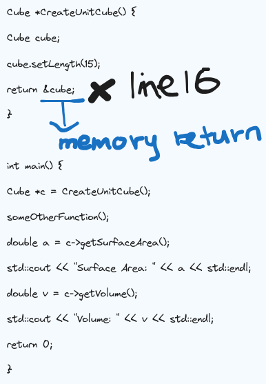

## Stack Memory

- It's written in hexadecimal, it's going to tells exactly the address of the variable stored in memory.
- we start with a huge address and we're going to keep moving down and down and down the memory addresses
- stack memory is the default memory for all variables in C++ to be placed.

## Pointer

- it is a variable that stores the memory address of data.
- simply an indirection away from our data
- i.e: integer pointer : `int *p=&num;` 
	- So, the type of the variable is int star
	- the name is p
	- and the value of what's stored in the integer pointer is going to be the address of the variable number.
 - **Deference operator**: 
	 - a level of indirection can be removed by preceding the variable with an asterisk.
	 - When you actually use the variable, if you prepend it with an asterisk, then that variable will remove the level of indirection. You'll dereference the memory address and get the actual value (i.e: `num_val=7`)

```
/* example of deference operator */
int num=7
int *p=&num 
int num_val=*p
*p=42
```


## Bad Example of Stack Memory
- here on line 16, we return the memory address of cube, but because we've returned from that function, we see that this memory is no longer allocated to us. 
- It's not our memory anymore.
- the stack frame exists only so long as the function is running




