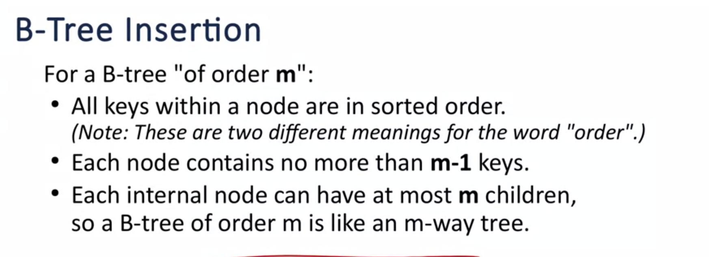
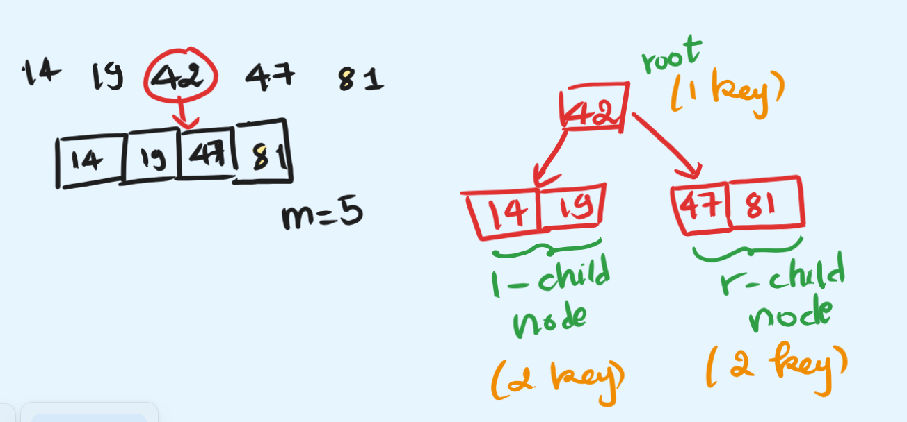
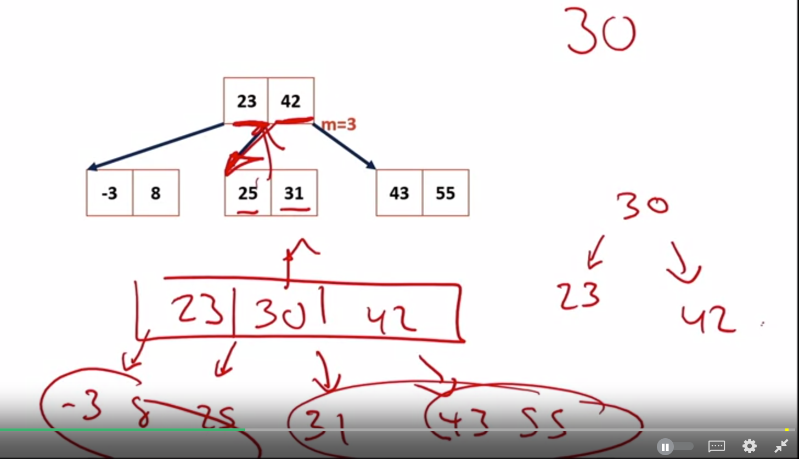
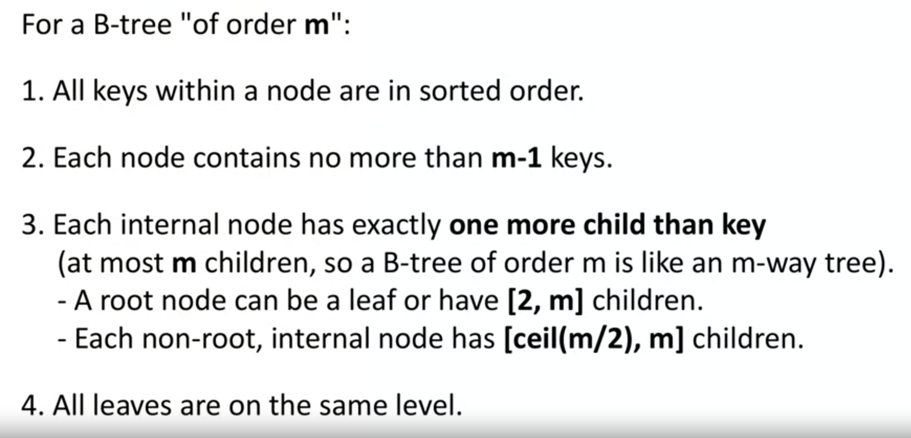
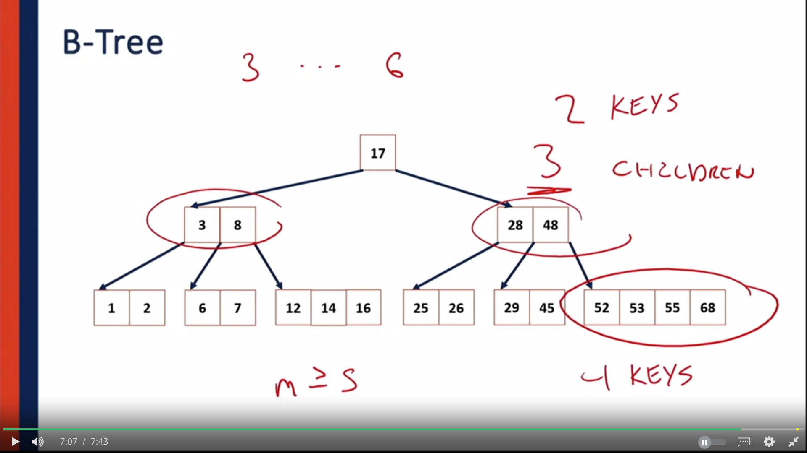
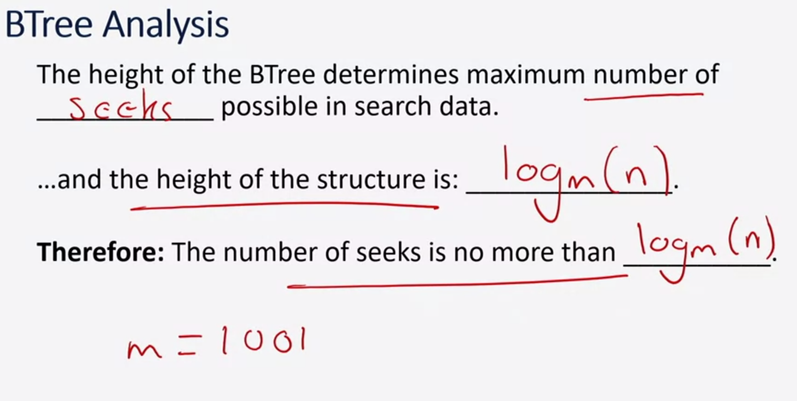
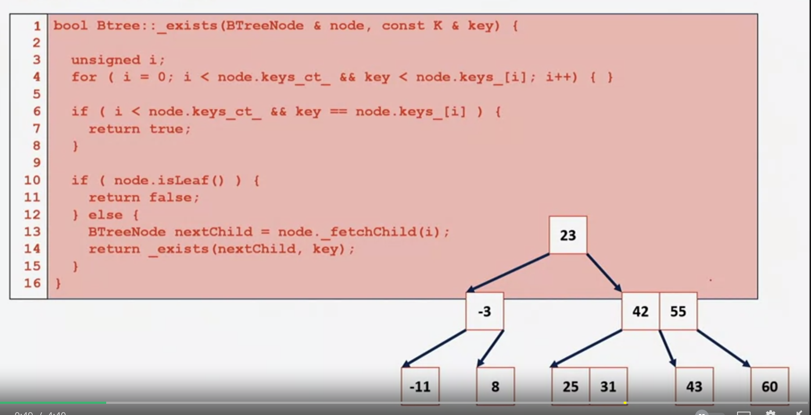

- Goal: is to create a data structure that's going to perform extremely well in both main memory, as well as in on disk, having  minimum of disk seek, or memory seek. 
- The order of a B-Tree is the maximum number of keys that a given node can have, plus one.
## B-Tree insertion 

- Example 

- B- Tree recursive insert 

- 

### B-Tree properties 

- a node with 4 keys, has 5 children 
- internal node is always at least half full 
- internal node only split up as soon as  it's full, so when it's splited up, it's half full 

### B-Tree Search 

- B-tree search code: 

- linear search for the key that we're looking for (O(n))
- if not at the current node, then child node will be fetched. (Olog_m(n))