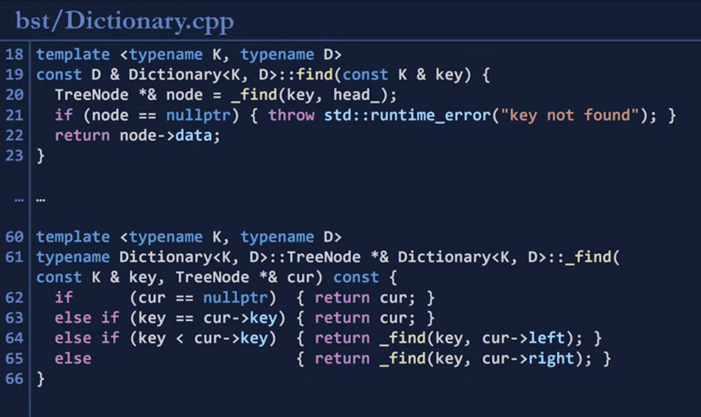
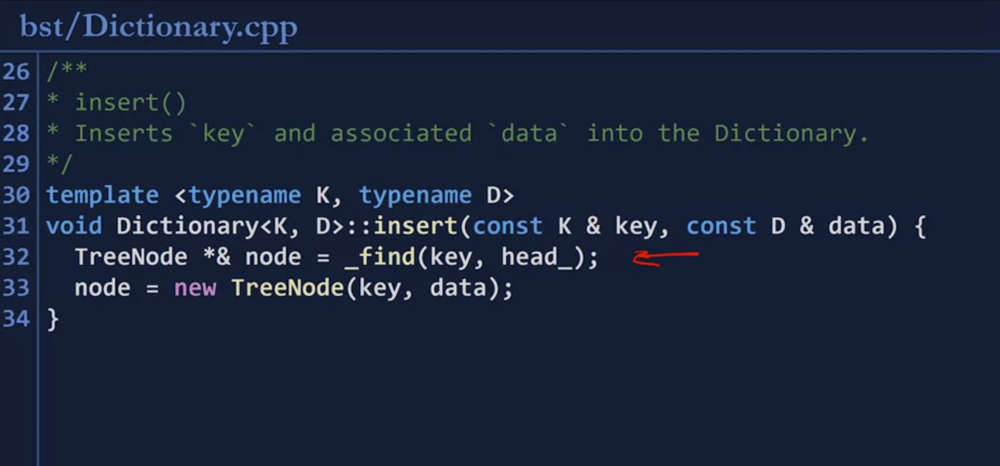
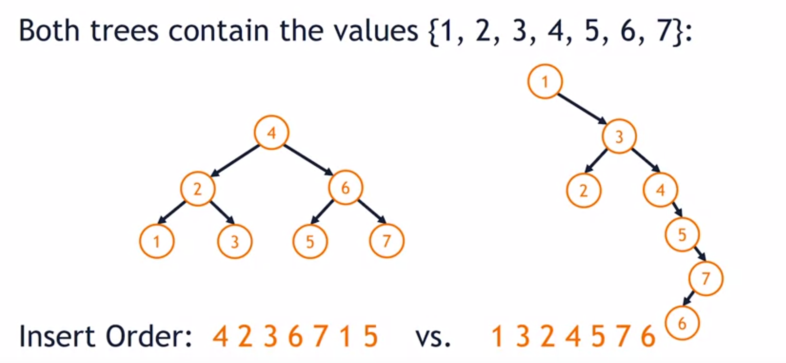
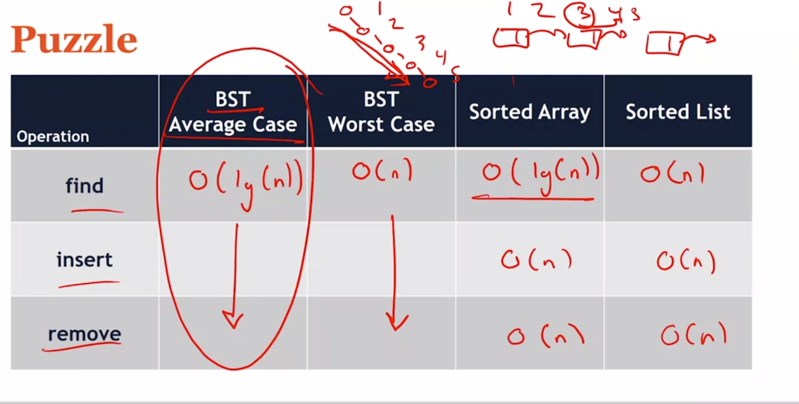
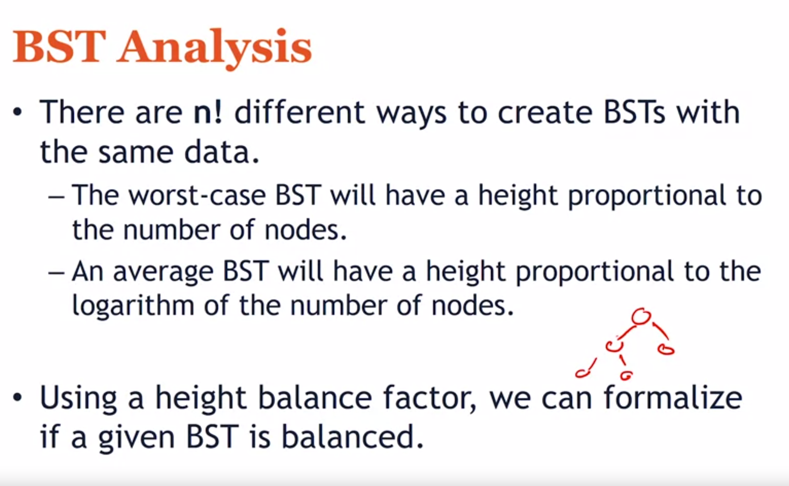

## Traversal 
- Pre-order
- in-order
- Post order
## Binary search tree
1. BST Order Property : For every node in the tree
- Nodes in the left subtree are less than itself 
- Nodes in the right subtree are more than itself
2. Binary Tree Property: height 
- Number of edges in the longest path from the root to a leaf. 
- 
## Dictionary: key -data 
- Key: unique
Dictionary ADT 
1. find 
2. insert
3. remove
4. empty\

- A BST used to  implement a dictionary will store both a key and data at every node

```
class Dictionary {

public:

	// Let the constructor just initialize the head pointer to null.
	Dictionary() : head_(nullptr) { }
	// find, insert, remove: Please see Dictionary.hpp for comments on these.
	
	const D& find(const K& key);
	
	void insert(const K& key, const D& data);
	
	const D& remove(const K& key);
	
private:

	class TreeNode {
	
		public:
			const K& key;
			const D& data;
	
			TreeNode* left;
			TreeNode* right;
			
			// **See note 2 below about how this initialization list is styled.
			
			TreeNode(const K& key, const D& data)
			
			: key(key), data(data), left(nullptr), right(nullptr) { }
	};
	TreeNode *head_;
```


## Run time of BST::find 

- Worst case outcome: O(h). h is height


- `find()` calls `_find()` . It will start with `head_`


## Insert 


## Remove 

- In-Order Predecessor (IOP) is the previous node in an in-order traversal of a BST. 
- IOP of a node will always be the right-most node in the node's left subtree.
![[20240207210441.png]]


All code is in `coursera-cs400/bst/Dictionary.hpp`


## BST Analysis 



- LHS tree: no. of nodes on lhs= nodes on rhs => balanced
- RHS tree: balance to the right 
1. HOw many possible ways we can insert the same data into a BST ?
- N! (N is no. of nodes)




- `insert()` and `remove()` is based off of `find()`
- For the case of Sorted Array and Sorted List, `O(n)` is based off of `find
- Worst case of BST: is linkedlist

### Height balance factor 

```
h= H(right_sub)- H(left_sub)

```

if no subtree found on a branch: `h=-1`


### Balanced BST 

- is a BST where every node's balanced factor has a  magnitude of 0 or 1 (i.e:-1,0,1)

## Summary 




- a perfect binary tree of height h has : 2^(h+1)-1 node
- a perfect binary tree with n nodes has:  h=log(n)
- fulll binary tree: each node has 0 or 2 children
- complete binatry tree: tree where all of the levels are fully filled, except for possibly the last level, left elements must lean towards leftl. 
- perfect binary tree: every internal node has exact;y 2 child nodes and all leaf nodes are at the same level
