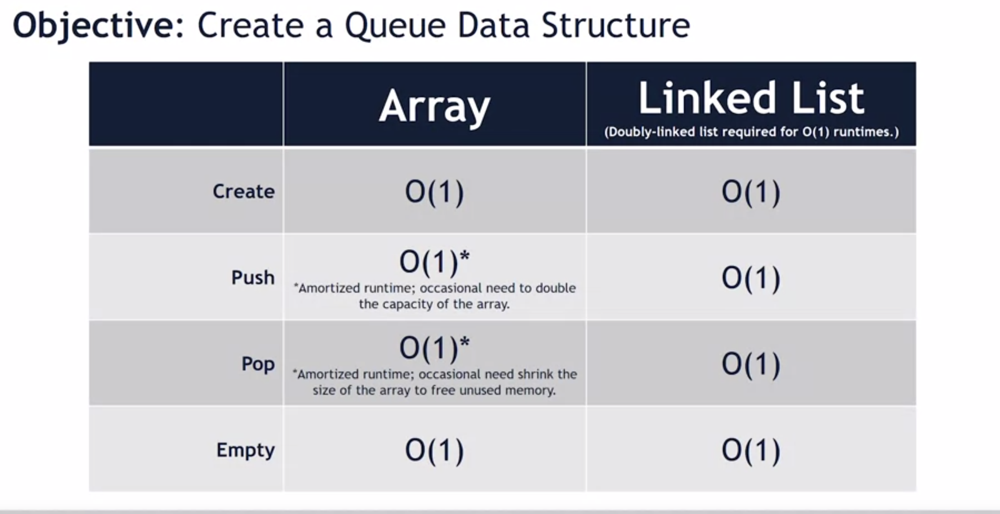

First in First out (FIFO) data structure 


1. Abstract Data Type
- ADT is how data interacts with the structure
- ADT is not an implementation, it's a description. 

2. Queue ADT
- Create 
- Push: add to back
- Pop: rm data from the front
- empty: return True is queue is mty. 

3. Queue in C++ 
```
std::queue<std::string> q;
```

`std::queue` is templated type. 
- Implementation of Queue can be either array or linked list queue




-  Queue runs in O(1) time. 
