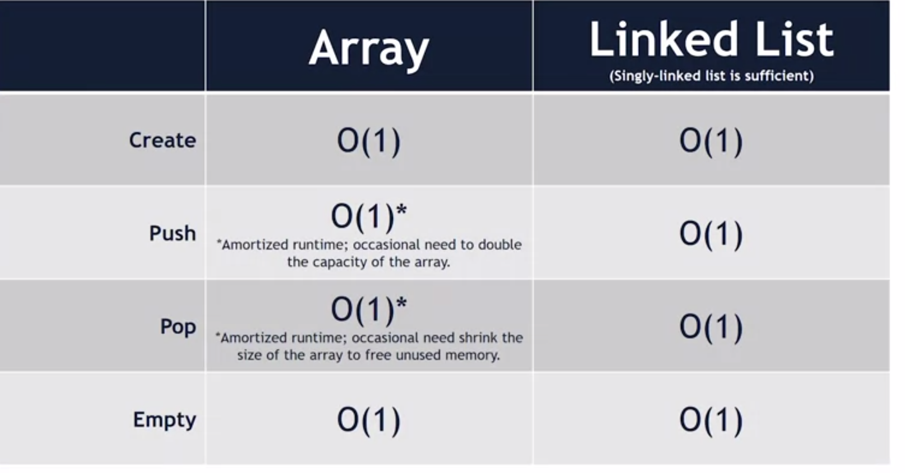

Last in first out (LIFO) data structure 

1. Stack ADT
- Create
- Push: add to top
- Pop:  remove from top 
- Empty


```
#include <stack>
std::stack <std::string> s; 
```


2. Implementation 
- Array: keep adding to the back of the array, allocate double size of the current array if more 
- Linked list: first elem. points to null, then add next elements to the front of list 
