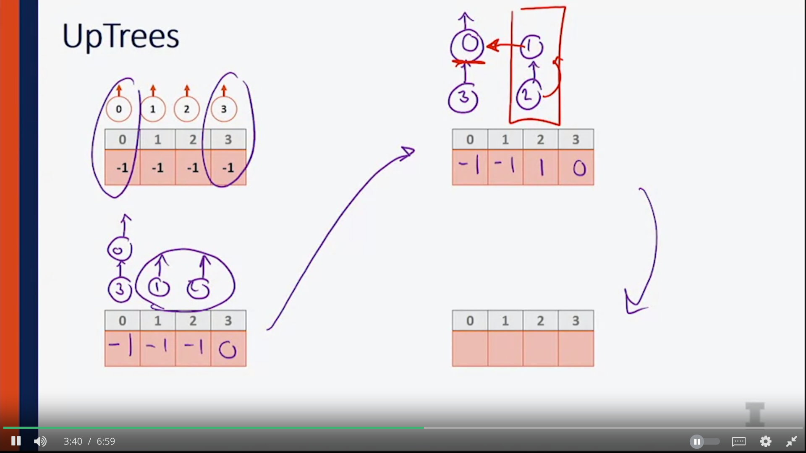

- A series of sets which are disjoint from one another, but every single element within a set Is considered to be equivalent within that set
- find operation: find the set identity for the set that contains the elem that we're looking for
- 

- Mathematically, we can talk about a set as being a collection of different sets
- disjoint set is going to be a collection of sets where each set has a unique identity on it
- Each set has a representative member and that's going to be element that uniquely identifies that set.
- we need to make a set from a single elem, then find the identity of a given element set, and we need to be able to union 2 sets together 

## Disjoint Sets: naive implementation 

- Store elem. from set with its identity 
- union operation -> O(n) as it traverses through the array to find each elem's identity-> costly 

## UpTrees - a better implementation 

- Updating pointer for unin 

### Running time of UpTrees 

- O(h): h is height -> worst case is O(n), n is numbers of nodes 

## Union & Path compression 

### Union by size 

- Both union by size and height preserve the height of the tree to be lg(n)
- height is calculated as =-(h+1)

### Path compression 

1. Iterated log: the number of times you can take a log of a number 

- only 5 times 

- O(1)* is amortized constant run time as iterative log*(n) is closed to 1 
