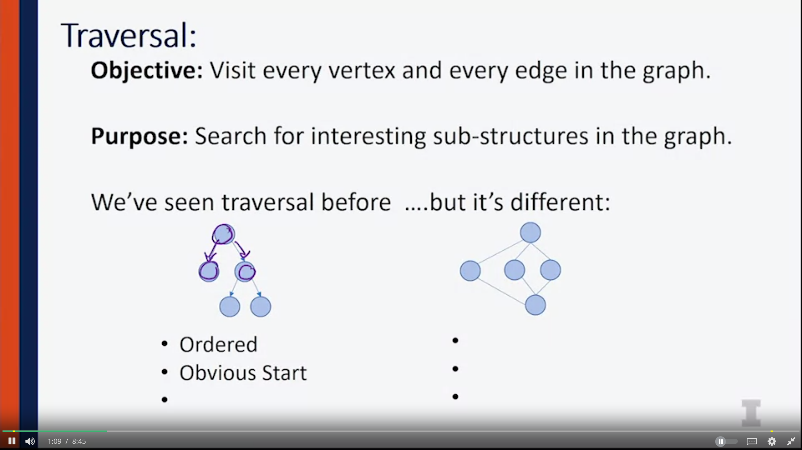
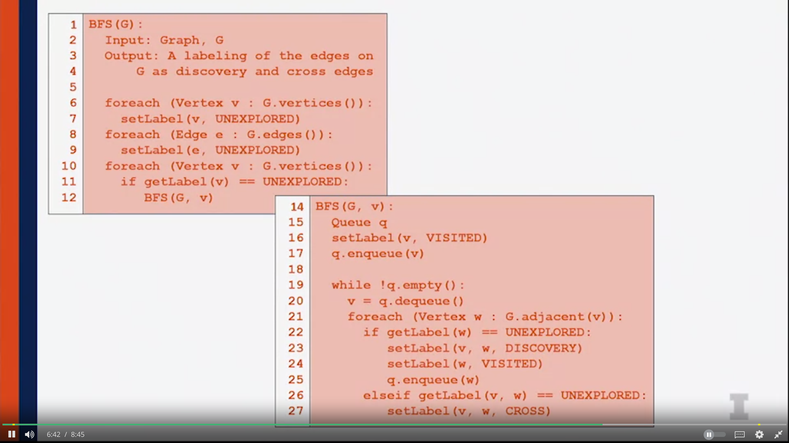
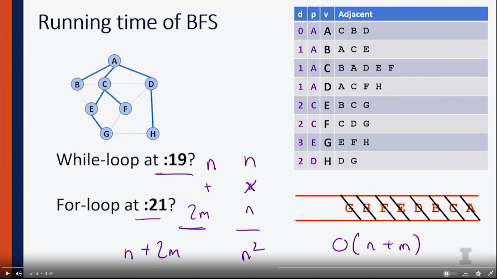
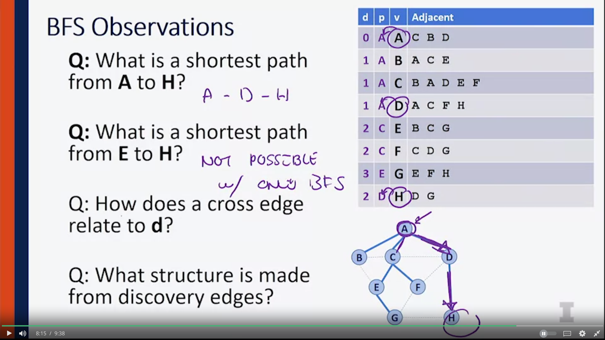
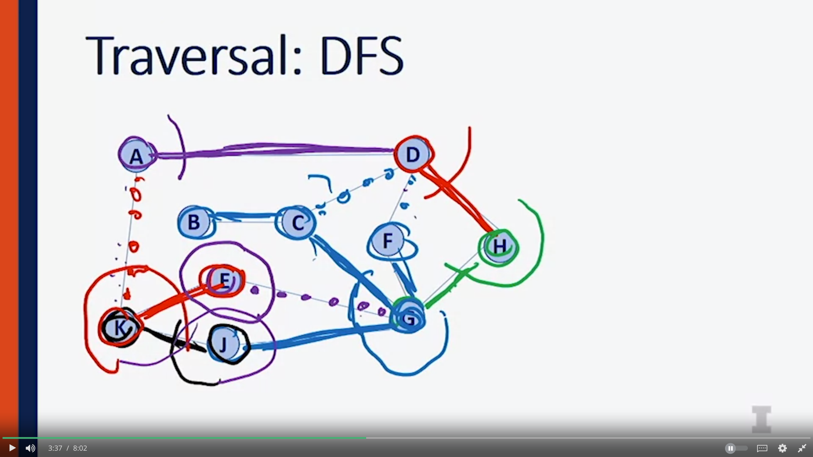
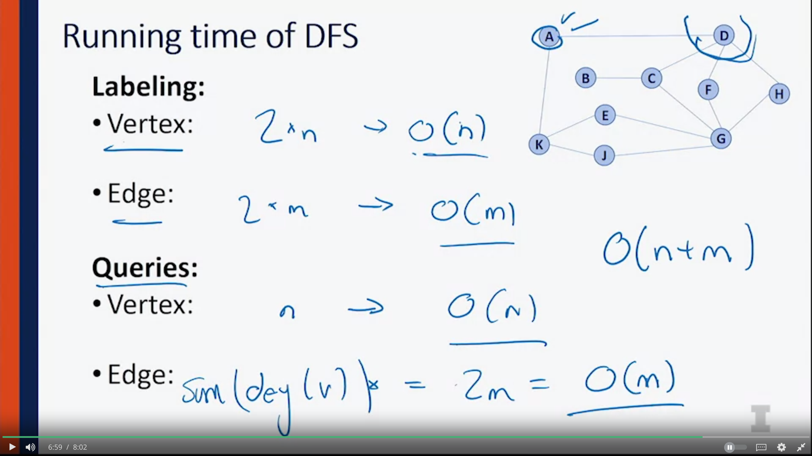

## Traversal

Graph: 
- No order
- No obvious start 
- Not necessarily entirely complete

##  Breath First Search 

1. Does this implementation handle disjoint graph? How do we use this to count component? 
- yes, line 10-13
- by adding `count++` under `BFS(G,v)`
1. Does it detect a cycle? how ?
- Yes , updating line 28 : `cycle=True`
- This happens because: as v has been visited, but the cross-edge of v-w hasn't been visited, that means that there's a line leading back to v -> there's a cycle 
1. Running time?

- n nodes to enqueue 
- 2m is the total degree of all nodes 
-> O(n+m)

- How does a cross edge relate to `d` (distance from starting point  to where we at)?
Cross edge is always going to somewhere nearby where we've been, if the edge is going to explore a new structure, it would have been a discovery edge. Because the discovery edge is going to be the first time we see this structure. So, when we have a cross edge, we know that somebody else has explored it already. So, that means, either one of our siblings or whenever our parents have already seen this edge before. So that means a single cross edge is always going to be nearby our existing edges.  
-> by following a cross edge, we will never get one more than one further from our root.  We'll never get more than one further from our start.

* What structure is made from discovery edges? --> spanning tree 

## Depth First Search 

- Discovery edge is solid 
- Back edge is dotted -> those connects new discovered node with node that has already been in the stack

- Code changed from BFS algorithm to DFS algorithm 
