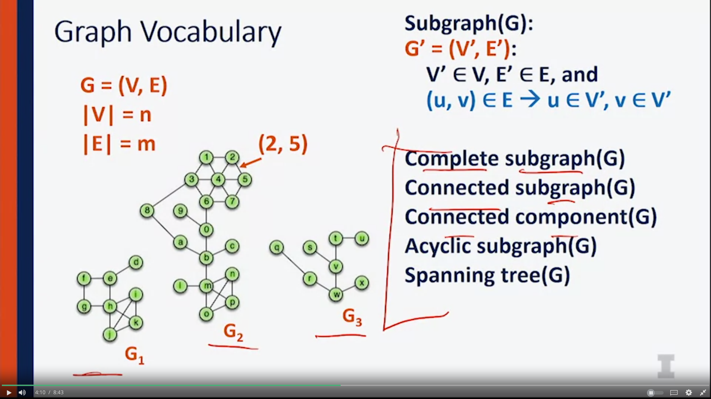

## Introduction 

- Incident Egdes: directly connected to a node 
- degree of a node: total of incident edges. 

##  Property
1.  How many edges: 
	- Minimum edges: 
		- Not connected: 
		- Connected: n-1 (n is nubers of node)
	- Maximum edges: 
		- Simple: n*(n-1)/2
		- Not simple : infinity 
- Simple graph: only 1 edge between nodes, acyclic 
1. Total degree
- 2m (m is numbers of edges in the graph)

## Edge List Implementation
### Basic ADT 

### Edge list 

- Insert: insert key at end of hash table 
- remove vertex: o(1)
- areAdj: go through the whole list of edges -> O(m) (i.e: is w & z adj? go thru a,b,c, only d is the edges)
- incidentEdges (v) -> go through all list of edges 

## Adjacency matrix implementation 

- in the adjacency matrix, the ptr of the edge that connects the 2 vertex is stored

- to insert: update the table of that nodes to every other node -> O(n)
- to remove: update table ->  O(n)
- areAdjacent: o(1)
- incidentEdges: column + row of that node -> 2n -> O(n)

###  Adjacency List Implementation 

- On the vertex list (adjacency list) : `u` points to a ptr of edge `a` which points to a ptr of edge `c`
- On the edge list of `a`, `u` points back to the ptr that points to `a`
- On the edge list `c`, `u` points back to the ptr that points to c

1. insertvertex : o(1)
2. removeVertex(vertex v): O(deg(v)), remove all the relevant pointers 
3. areaAdjacent(v1,v2)

- go thru all the edge list that connect to the vertex, see if there's another vertex in it 
- run time: min(deg(v1),deg(v2))
4. incidentEdges(v) : simply walk the vertex linkedlist -> O(deg(v))

## Summary of run time 

