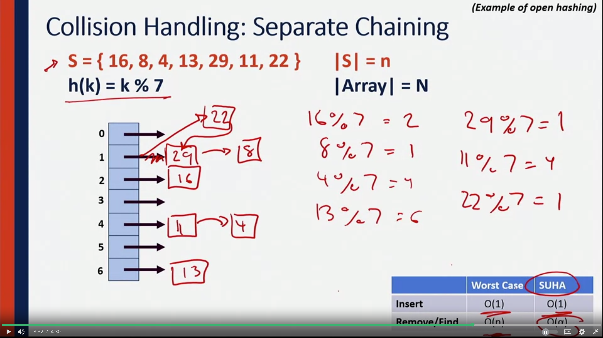
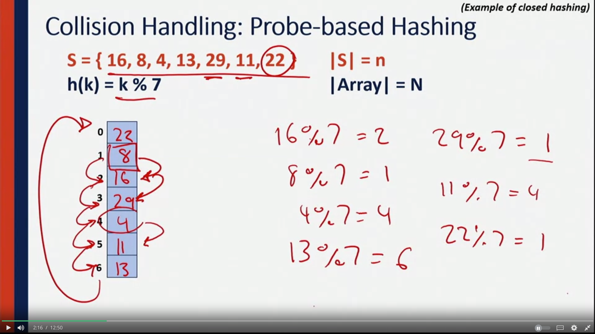
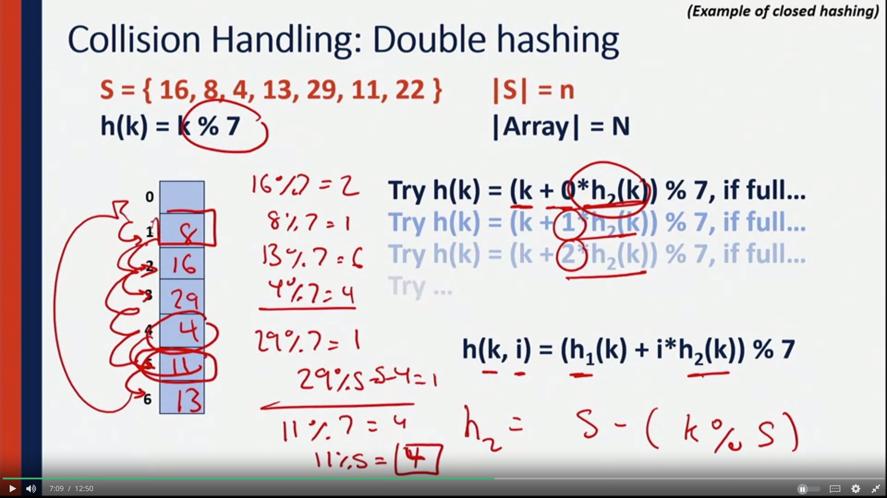
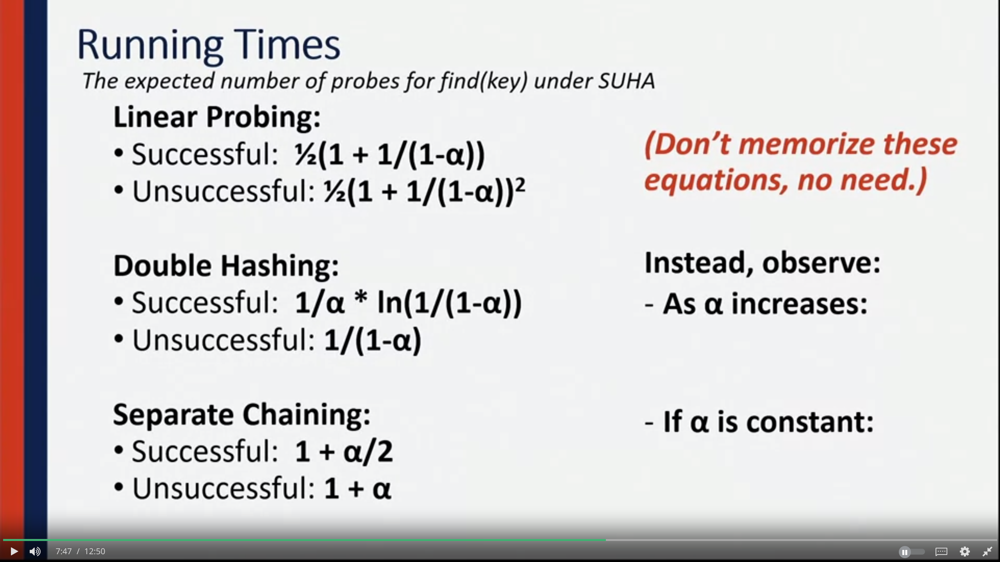
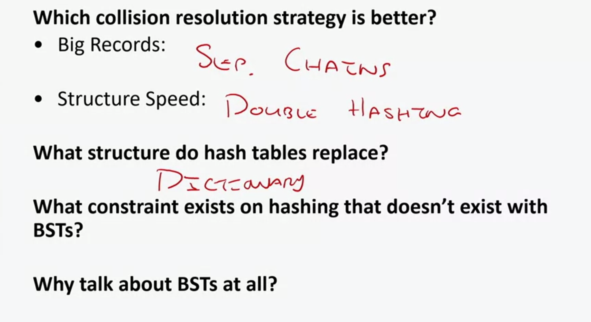
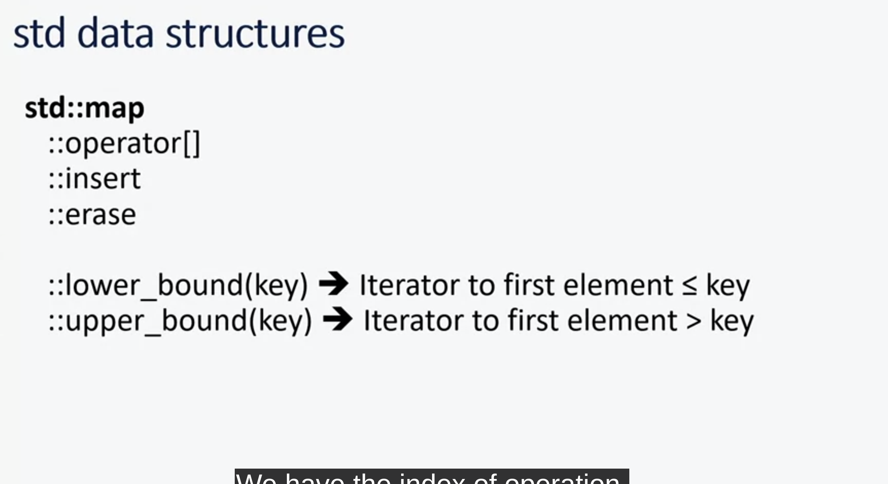
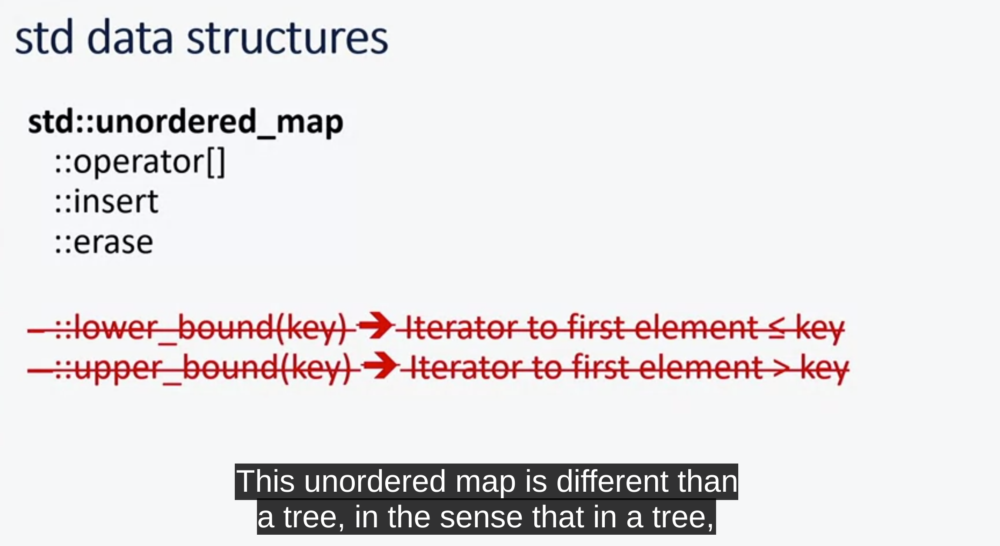
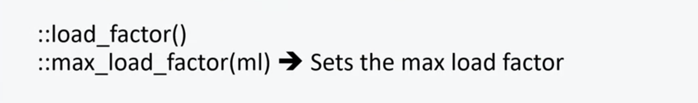

- a keyspace that we want to transform into a number of different values 
- use a funciton to map the keyspace into a small set of integers
- A hash table consistst of 3 things:
1. Hash function 
2. an array: stores the actual data
3. Collision handling strategy 

## Hash Function 

- Hash function consists of 2 parts:
1. A hash: function to turn input -> numeric 
2. A compression : mod  N -> to make sure we're not going out of bound of an array

- Good hash function:
1. Computation time: O(1) time to compute a hash 
2. Deterministic: 2 similar strings hashed to be in the same key space
3. Sastisfy the SUHA (Simple Uniform Hashing asumption): results of hash function must be uniform accross the entire key space 

$$
P(h(a) ==h(b))= 1/N ,a!=b
$$

- For example: if there're 2 numbers to be hashed, they have the same 50% chance of being distributed  across the entire space. 

## Collision handling: seperate chaining 

- given set S, load S into the table using hash function `h(k)`
- For inserting item with the same key: linked list insert at head -> O(1)
- alpha: load factor of a table -> n/N  (numbers of elem. in  a table divided by the size of the table itself.

## Collision handling: probe-based hashing 

- When collision happens: look up the next availble slot in the array to fill it up 

## Collision handling: double hashing 

- secondary hash function that's going to allow us to hash into a new index that's not necessarily immediately following the other points.

- Following `h(k)= k%7` , use `h2=s-(k%5)` to find the step size needed to jump 

## Running times

- the running time is determined only upon the ratio of the amount of data in our hash table to the size of the array and not the actual amount of data itself (alpha)
- as long as we keep alpha the same (less than 0.6), running time is O(1)
- we going to have to resize the array every so often 

## Rehashing 

- When we grow the size of the array, rehashing makes sure that our elem. is in the proper spot of the new array. 

## Hashing Analysis 

- For problems of finding neighbors: use Trees
- For finding: use hashtable 

## Hash Tables in C++ 

### std::map

- std has buiit-in function for dictionary (`std::map`)
- `std::map` is often implemented as red-black tree
- `std::map` : log(n)

### std::unordered_map 

- In a tree: we can do `lower_bound()` and `upper_bound()` search, not with `unordered_map
- we have no range finding ability inside a hash table 

- we can set the load_factor we want the algorithm to target 

