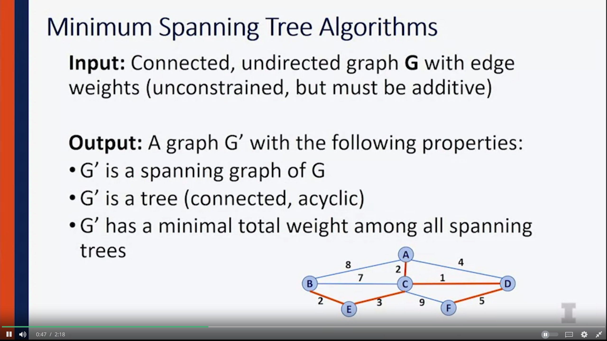
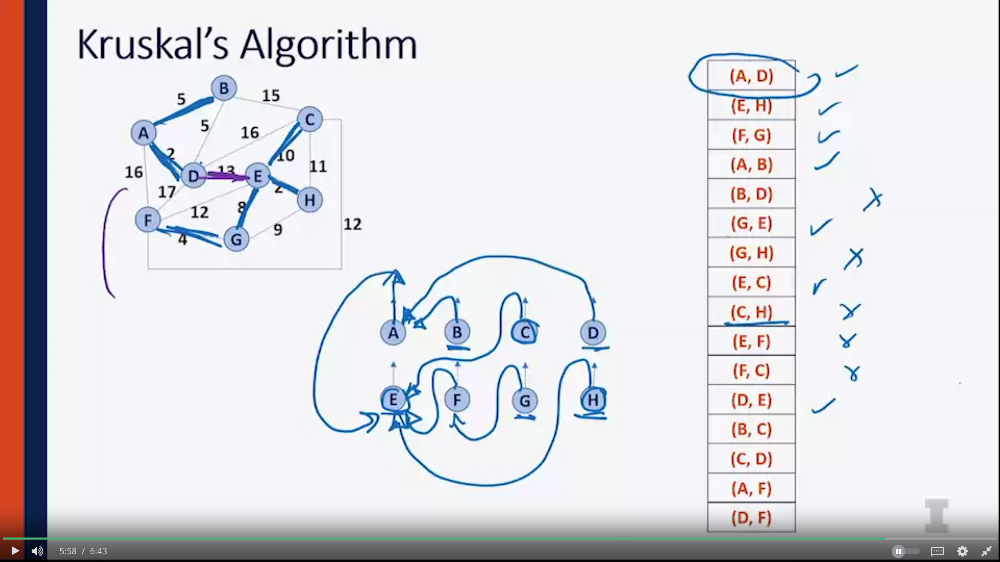
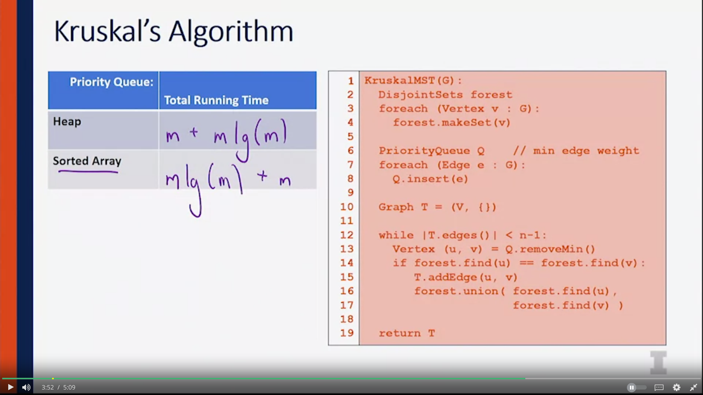

# Minimum Spanning Tree 

## Kruskal's Algorithm 

- Distances between verteces are store in min heap (smallest to largest)
- All vertices are first initialized as individual disjoint set 
- Go thru edges in the heap, if vertex in edge are not belong to the same set, reunion them

### Runtime analyses 

- Heap : (buiding heap o(m) + remove edges lg(m))* m
- Sorted array: (buiding lg(m) + remove take o(1))*m
=>  both takes mlog m

- updated code of above : 
![[Pasted image 20240301015842.png]]

## Prim's algorithms

### Partition property

![[20240301020418.png]]

![[20240301023430.png]]

- we have created a number of different steps that we  start with just a single node
-  we looked at partition that separates that node in the labeled set from every other node
- We find the minimum edge that bridges that partition,add it to our labeled set
- look at the next partition and find the minimum node that spans that partition
--> this whole process ends up creating a spanning tree that is a minimum spanning tree of the graph.

### Code 

![[20240301023831.png]]

After running the  algorithm: 

![[20240301025545.png]]

### Run Time Analysis 

![[20240301025706.png]]

- The time it takes to build our minimum spanning tree, is going to always be proportional to  the number of edges in the graph times the log of the number of edges in the graph, no matter what algorithm we use.
![[20240301032600.png]]

- For very dense graph, prim's algorithm will be able to run in propotional to numbers of verteces. 