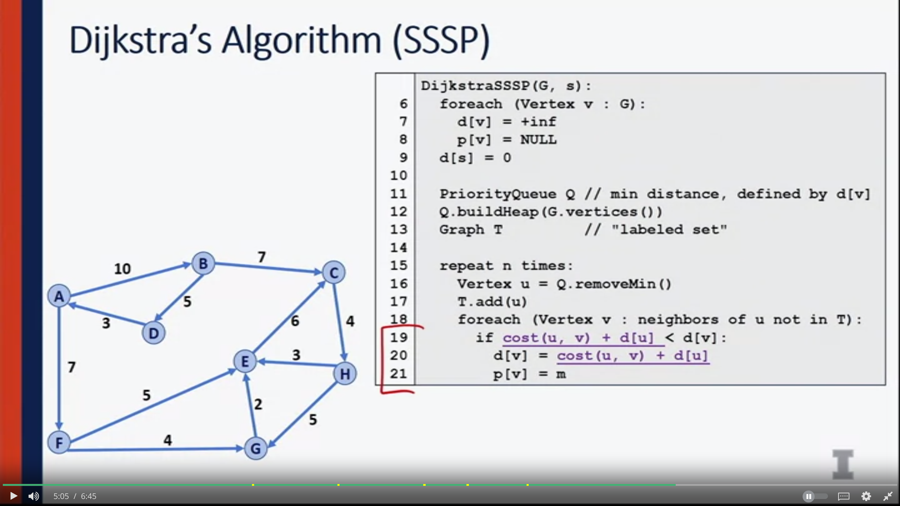
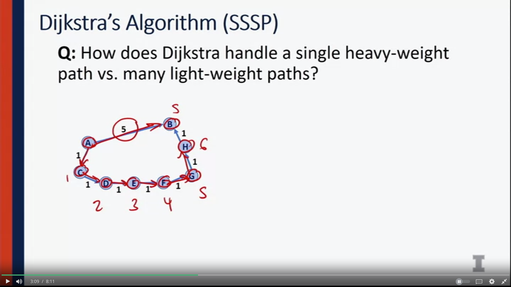
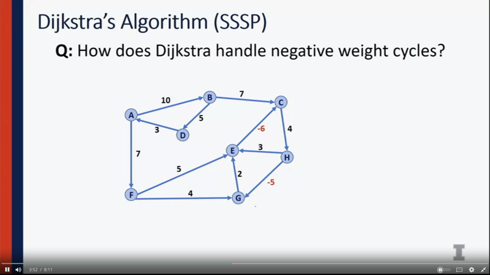
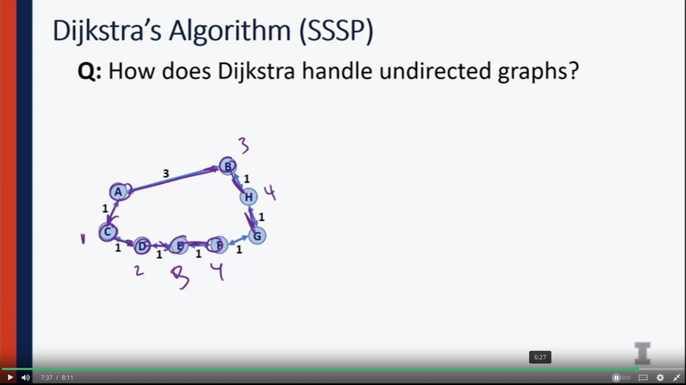
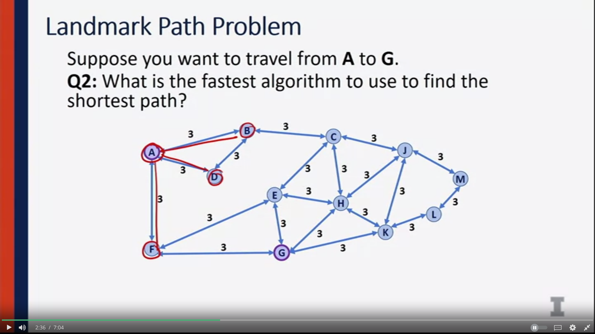
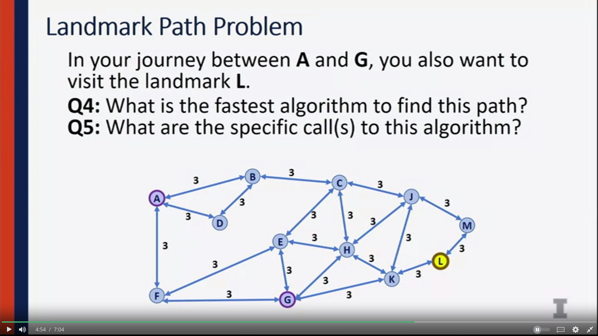

### Dijkstra's algorithm 

- Dijkstra gives us the shortest path to every vertex 
- SSSE: single source shortest path 
### Edge Cases 
1. Single heavy-weight vs many light-weight path?

- Dikstra still finds the shortest path, but took slightly longer 

2. Negative edges 
- can't 

3. Undirected graph 

### Runing Time Analysis 

O (m + nlog(n))

## Landmark path's problem

- In the case if all edges are weighted the same --> use BFS because O(m+n)

- Start from L -> make Minimum Spanning Treee
- A->L->G = A->L + L->G = L->A + L->G 