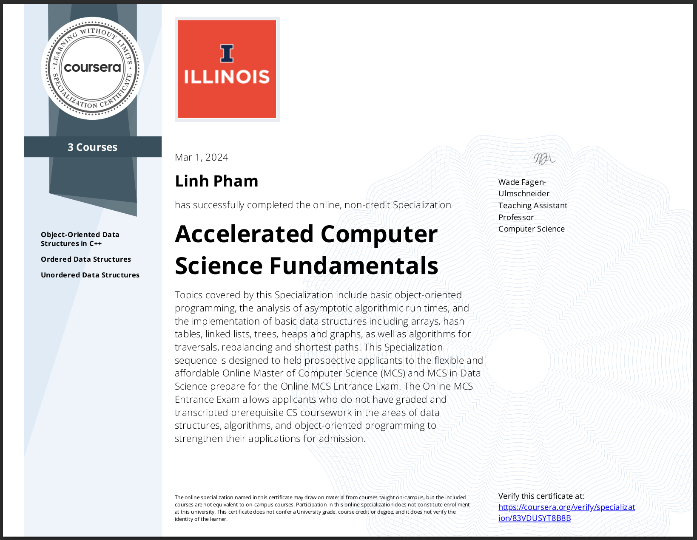
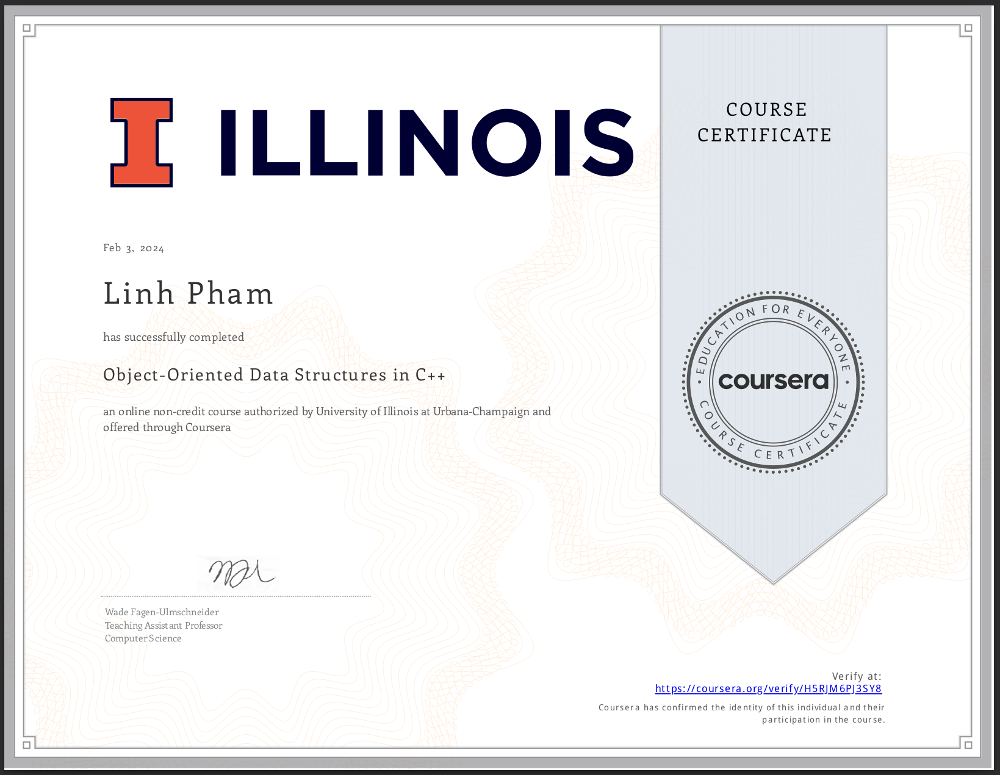

# UIUC fundamental CS specializations

This is the repository for my notes from [coursera UIUC fundamental CS specializations](https://www.coursera.org/specializations/cs-fundamentals?)

There are 3 courses from this specialization
	<ul> 
		<li>Object Oriented Programming in C++ </li>
        <li>Unorder data structures </li>
        <li>Order data structures </li>
	</ul>

## 🚀 Object Oriented Programming in C++

### CPP Memory

1. [Stack Memory](./OOP/CppMemory/StackMemory.md)
2. [Heap Memory](./OOP/CppMemory/HeapMemory1.md)
3. [Heap Memory puzzles](./OOP/CppMemory/HeapMemory2.md)

### Basic syntax

1. [Loop](./OOP/BasicSyntax/Loop.md)
2. [Syntax](./OOP/BasicSyntax/Syntax.md)

### CPP Classes
1. [Constructors](./OOP/Classes/Constructors/)
2. [Destructors](./OOP/Classes/Destructors/)
3. [Inheritance](./OOP/Classes/Inheritance/)
4. [Template](./OOP/Template/Template.md)
5. [Variable Storages](./OOP/Classes/VariableStorages/)

##  🌟 Ordered data structures
1. [Array & Linked List](./OrderedDS/Array&List.md)
2. [Queue](./OrderedDS/Queue.md)
3. [Stack](./OrderedDS/Stack.md)
4. [AVL Trees](./OrderedDS/AVL/)
5. [Binary Trees](./OrderedDS/Binary_Tree.md)
6. [B-Tree](./OrderedDS/B-Tree.md)
7. [Heap](./OrderedDS/Heap.md)

## 💫 Unordered data structures

1. [Hashing](./UnorderedDS/Hashing.md)
2. [Disjoint Set, Union](./UnorderedDS/DisjointSet.md)
3. [Graph](./UnorderedDS/Graphs.md)
4. [Breath First Search, Depth First Search](./UnorderedDS/GraphAlgorithms.md)
5. [Minimum Spanning Tree](./UnorderedDS/MST.md)
6. [Dijkstra's algorithms](./UnorderedDS/ShortestPath.md)

# Certificates

